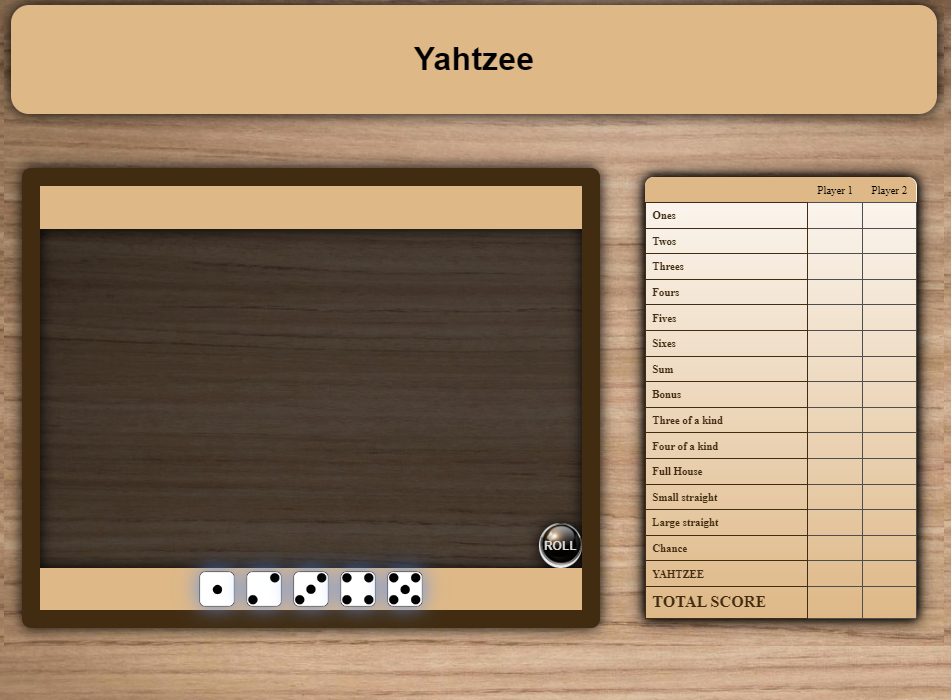

# Yatzy Game Design Documentation

This document outlines the design and style guide for my Yatzy game project. It follows a design system approach to ensure consistency, clarity, and a great user experience.

## **Design System**

### **Colors Palette**
-   Primary Color: #deb887 - Used for background.
-   Secondary Color: #412c12 - Used for border and text.
-   Tertiary Color: #00000066 - Used for play area, to create a translucent effect.

### **Typography:**
-   Headings: Ubuntu.
-   Body Text: Times New Roman.

### **Look and Feel:**
The game creates a cozy look with a wooden background and similar colors. All components come with shadows to make them more visually appealing.

### **Game Mock-ups:**

